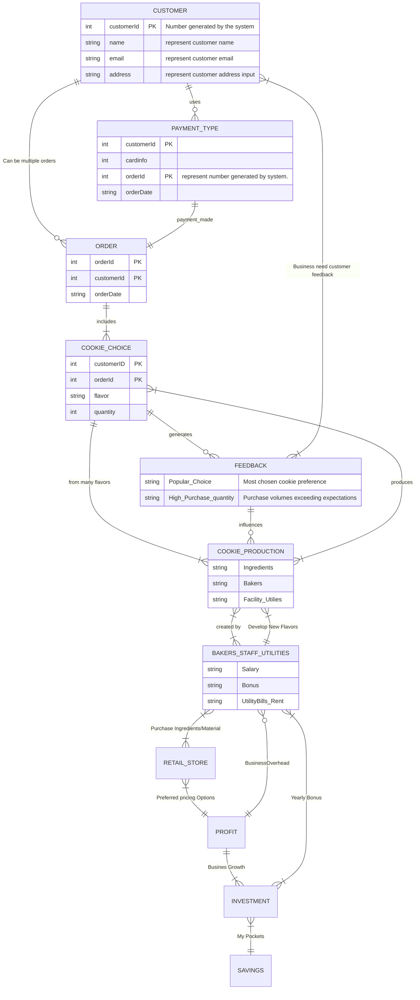

# Cookie Land

## This is how I plan to Make Cookie Profits

In this repo I lay out my plans to sell many cookies.
To flood the market with remarkable cookie flavors. To build my cookie Empire. Follow my rise to cookie stardom.

# Creating Magnificent Customer Relationship

## Flow Chart to Explaining how Cookie Land provide the best cookies to it's customers.

[Click link to view Breakdown of this diagram, which was done using ChatGpt. I used the AI as it would avoid errors in grammar. Also this is the future, AI will be involved in coding in a greater degree.](cookieland_breakdown.md)

[Home](README.md)